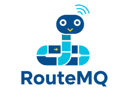

# RouteMQ Framework

A flexible MQTT routing framework with middleware support, inspired by web frameworks.

## Features

- **Route-based MQTT topic handling**: Define routes using a clean, expressive syntax
- **Middleware support**: Process messages through middleware chains
- **Parameter extraction**: Extract variables from MQTT topics using Laravel-style syntax
- **Optional MySQL integration**: Use with or without a database
- **Group-based routing**: Group routes with shared prefixes and middleware
- **Context manager for route groups**: Use Python's `with` statement for cleaner route definitions

## Installation

Clone this repository:

```bash
git clone https://github.com/ardzz/RouteMQ.git
cd RouteMQ
pip install -e .
```

## Quick Start

1. Initialize a new project:

```bash
python main.py --init
```

2. Edit the `.env` file with your MQTT broker details:

```
MQTT_BROKER=localhost
MQTT_PORT=1883
MQTT_USERNAME=your_username  # Optional
MQTT_PASSWORD=your_password  # Optional
```

3. Run the application:

```bash
python main.py --run
```

## Creating Routes

Define your routes in `app/routers/api.py`:

```python
from core.router import Router
from app.controllers.your_controller import YourController

router = Router()

# Simple route
router.on("sensors/temperature", YourController.handle_temperature, qos=1)

# Route with parameters
router.on("devices/{device_id}/status", YourController.handle_device_status)

# Route groups with middleware
from app.middleware.auth import AuthMiddleware

with router.group(prefix="admin", middleware=[AuthMiddleware()]) as admin:
    admin.on("devices/{device_id}/configure", YourController.configure_device)
```

## Creating Controllers

Controllers handle the business logic for each route. Create your controllers in `app/controllers/`:

```python
from core.controller import Controller

class YourController(Controller):
    @staticmethod
    async def handle_temperature(payload, client):
        # Access the temperature data from payload
        temperature = payload.get('value')
        print(f"Temperature: {temperature}°C")
        
        # Do something with the data
        # ...
        
        return {"status": "processed"}
    
    @staticmethod
    async def handle_device_status(device_id, payload, client):
        # The device_id parameter is extracted from the topic
        print(f"Device {device_id} status: {payload}")
        
        # Do something with the device status
        # ...
        
        return {"status": "processed"}
```

## Creating Middleware

Middleware can process messages before they reach the handler. Create your middleware in `app/middleware/`:

```python
from core.middleware import Middleware

class YourMiddleware(Middleware):
    async def handle(self, context, next_handler):
        # Do something before the handler
        self.logger.info(f"Processing message on topic: {context['topic']}")
        
        # Modify the context if needed
        context['payload']['timestamp'] = time.time()
        
        # Call the next handler in the chain
        result = await next_handler(context)
        
        # Do something after the handler (if needed)
        self.logger.info("Message processed")
        
        return result
```

## Database Integration

If you need database support, set `ENABLE_MYSQL=true` in your `.env` file and configure the database connection parameters. Create your models in `app/models/`:

```python
from sqlalchemy import Column, Integer, String, Float
from core.model import Base

class SensorReading(Base):
    __tablename__ = "sensor_readings"
    
    id = Column(Integer, primary_key=True)
    sensor_id = Column(String(50))
    value = Column(Float)
    timestamp = Column(Integer)
```

## License

MIT License
