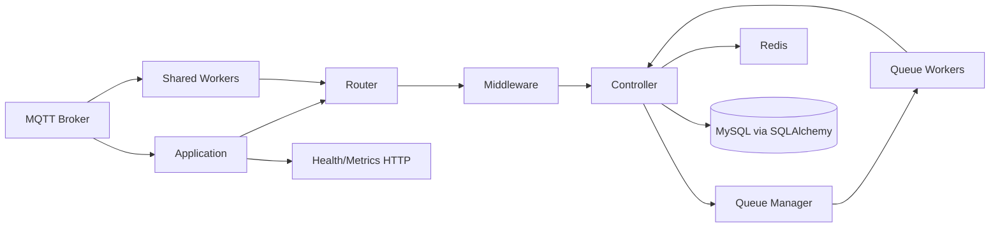

# RouteMQ Architecture

RouteMQ is a Laravel-style MQTT routing framework for Python 3.12+ applications. It maps MQTT topics to controller handlers through route definitions, middleware chains, optional model access, and queue dispatch helpers.

At runtime RouteMQ uses the synchronous paho MQTT client alongside an asyncio event loop. MQTT callbacks hand work to the loop with `asyncio.run_coroutine_threadsafe`, so route dispatch, middleware, controllers, and queued jobs can remain async while broker I/O stays compatible with paho.

## Components

- **Application** initializes environment settings, logging, MQTT connectivity, route discovery, optional services, and worker processes.
- **Router** stores topic routes, compiles parameterized topics, and dispatches inbound messages to the configured handler chain.
- **Middleware** wraps controller handlers with reusable request processing such as validation, rate limiting, or authentication.
- **Controller** contains application-specific async handlers for matched MQTT topics.
- **Queue Manager** selects the configured queue backend and exposes dispatch helpers for background jobs.
- **Queue Workers** run queued jobs asynchronously with retry and queue selection behavior.
- **Shared Workers** run separate MQTT consumer processes for routes that use shared subscriptions.
- **Health/Metrics HTTP** exposes operational endpoints for readiness, liveness, and metrics when enabled.
- **Observability** comes from structured logging, health checks, metrics endpoints, and documented release evidence.
- **Redis Manager** provides optional Redis connection management and helpers for features such as rate limiting and queues.
- **Model** provides the async SQLAlchemy base for optional MySQL-backed application models.

## Further reading

- [Repository knowledge base](../AGENTS.md)
- [Architecture decision records](./adr/)
- [Release conformance](./release-conformance.md)
- [Monitoring](./monitoring/)
